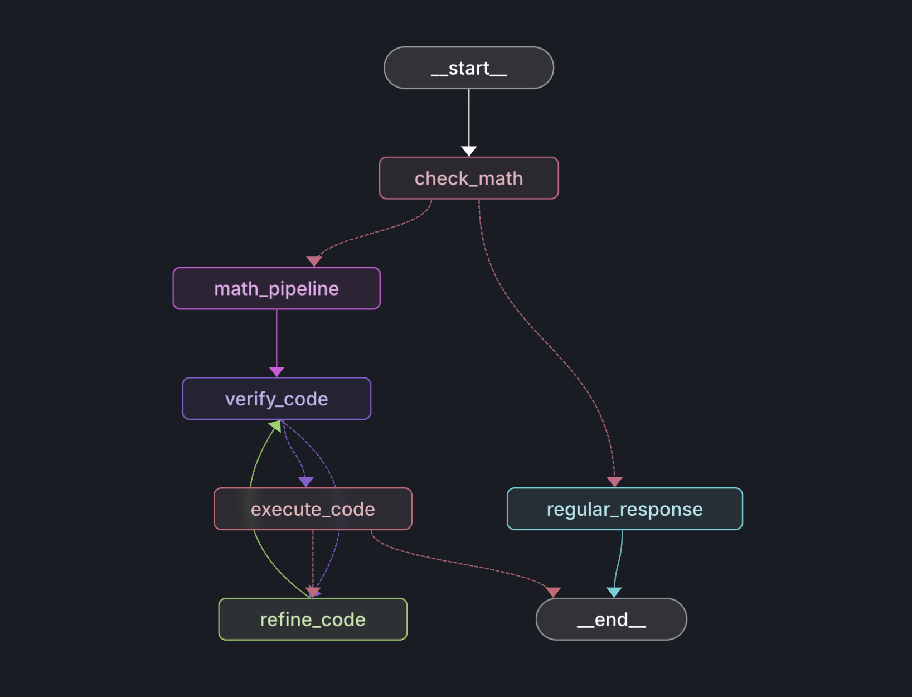

# Math Code Generation Pipeline

This repository implements a dynamic pipeline that uses AI-powered prompts and a state graph to generate, verify, refine, and execute Python code for solving math-related problems using NumPy. The pipeline leverages the [Ollama](https://ollama.com) client for interacting with language models, as well as components from LangGraph and LangChain.

## Overview

The pipeline works as follows:
1. **Math Question Detection:** It determines whether a given question requires mathematical computation.
2. **Code Generation:** If math-related, the system generates efficient, vectorized NumPy code based on the problem prompt.
3. **Code Verification:** The generated code is then verified for syntax, logical correctness, numerical stability, and adherence to problem requirements.
4. **Code Refinement:** If any issues are found, the pipeline refines the code based on detailed feedback.
5. **Code Execution:** Once the code passes verification, it is executed, and the printed output is captured.
6. **Fallback Response:** If the question is not math-related, the system responds with a default message.

The entire process is orchestrated using a state graph where each node represents a specific step in the workflow.

## Architecture Diagram

Below is a placeholder for the architecture diagram of the pipeline. Replace the placeholder image with your actual architecture diagram when available.



## Features

- **Automated Math Detection:** Determines if the question is math-related via an AI prompt.
- **Dynamic Code Generation:** Creates reusable NumPy code to solve mathematical problems.
- **Iterative Verification and Refinement:** Checks the generated code against a checklist and refines it if necessary.
- **Safe Code Execution:** Executes the code in a controlled environment while capturing output and errors.
- **State Graph Workflow:** Leverages a state graph for clear, modular, and conditional processing of tasks.

## Dependencies

- **Python 3.7+**
- **[numpy](https://numpy.org/)** for numerical operations.
- **[langgraph](https://github.com/langchain-ai/langgraph)** for state graph management.
- **[langchain_core](https://github.com/langchain-ai/langchain)** for prompt templating.
- **[ollama](https://ollama.com/)** for AI model integration.

### Installation

Install the required packages using pip:

```bash
pip3 install -r requirements.txt
```

> **Note:** Make sure the Ollama client is configured correctly and the specified model (`qwen2.5-coder:32b`) is available in your environment.

## Code Structure

- **Prompts:**  
  The project defines several prompt templates for different stages:
  - **Math Check Prompt:** Determines if the question is math-related.
  - **Code Generation Prompt:** Guides the AI to generate NumPy code.
  - **Verification Prompt:** Checks the generated code for correctness.
  - **Refinement Prompt:** Provides instructions to improve the code based on feedback.

- **Nodes (Workflow Steps):**  
  Each node in the state graph represents a step in the processing pipeline:
  - `check_math_question`: Uses AI to determine if the question involves math.
  - `generate_initial_code`: Generates initial Python code using the math problem prompt.
  - `verify_code`: Validates the generated code against a checklist.
  - `refine_code`: Refines the code based on verification feedback.
  - `execute_code`: Executes the approved code and captures its output.
  - `regular_response`: Returns a default message for non-math queries.

- **Routing:**  
  Custom routing functions (`route_based_on_math`, `route_based_on_verification`, `route_based_on_execution`) determine the flow of execution based on the state of the processed data.

- **Graph Setup:**  
  The state graph is constructed by adding nodes and defining edges (both conditional and direct) to create a complete workflow.

## Running the Pipeline

To run the pipeline, import the compiled graph and execute it with an initial state. For example:

```python
from your_module import graph, GraphState

# Define the initial state with the user question
initial_state: GraphState = {
    "question": "Calculate the sum of an array of numbers.",
    "math_related": False,
    "generated_code": "",
    "verification_result": {},
    "refinements": [],
    "final_answer": ""
}

# Run the state graph workflow
result = graph.run(initial_state)
print(result["final_answer"])
```

The workflow processes the input question through math detection, code generation, verification, refinement (if needed), and finally execution, outputting the final code along with any printed results or error messages.

## Error Handling

- **Code Verification:** If the generated code does not meet the required standards (e.g., includes forbidden `input()` calls or has syntax errors), the pipeline provides detailed feedback.
- **Execution Errors:** If an error occurs during code execution, the pipeline captures the error message and stack trace, then routes back to code refinement for further improvements.

## License

This project is licensed under the MIT License.

## Acknowledgements

- **LangGraph:** For state graph management.
- **LangChain:** For prompt templating.
- **Ollama:** For AI model integration.